---
# the default layout is 'page'
icon: fas fa-info-circle
order: 4
layout: post
toc: true
---

### **📋 Profile**

노현수 
2000.11.07 
+8210-8514-8477 
<a href="mailto:kevinsoo1014@gmail.com">kevinsoo1014@gmail.com</a> 
계원예술대학교 디지털미디어디자인과 프로그래밍 세부 전공

### **🙋 Who I Am**

안녕하세요. 항상 발전하기 위해 노력하는 프론트엔드 개발자 노현수입니다. 
저는 꾸준히 개발 기술을 공부하며, 끊임없이 성장하는 개발자가 되기 위해 노력하고 있습니다. 
또한, 소통을 중시하고 팀원들과의 협력을 통해 더 나은 결과물을 만들어내는 과정에서 큰 성취감을 느낍니다. 
성실함을 바탕으로 지속적인 성장을 목표로 삼고 있습니다.

### **🎓 학력**

| 학교명                      | 기간          | 비고 |
| :--------------------------- | :--------------- | ------: |
| 계원예술대학교 디지털미디어디자인과 프로그래밍 세부 전공  | 2023.03 ~ 2025.02 | 재학중 |
| 고잔고등학교  | 2016.03 ~ 2019.02    |   졸업 |

### **📅 수상 및 이력**

| 이력                      | 기간          | 비고 |
| :--------------------------- | :--------------- | ------: |
| 커뮤니케이션디자인국제공모전  | 2024.07 | 우수상 |

### **🛠 기술 스택**

#### 프론트엔드
- 
    - `HTML5` 기본 문서에 구조에 대한 이해도가 높습니다. `<html>`, `<head>`, `<meta>`, `<body>` 등의 기본 태그들에 대한 이해와 활용 능력이 있습니다.
    - `<article>`, `<section>`, `<header>`, `<footer`>와 같은 시멘틱 요소를 사용하여 웹페이지의 의미를 명확하게 표현할 수 있습니다. 이를 통해 SEO 최적화에 기여할 수 있습니다.
    - 웹 표준을 이해하고 준수하기 위해 노력하고 있습니다.
- 
    -  `Media Query`를 활용하여 다양한 화면 크기에서 반응형 레이아웃을 조정하고, 사용자 경험을 최적화하는 데 능숙합니다.
    -  `CSS3`의 애니메이션 및 전환 기능을 사용하여 웹 요소의 시각적인 효과를 구현할 수 있습니다.
    - `Flexbox`와 `CSS Grid` 레이아웃에 대해 충분히 이해하고 있으며, 이를 활용해 웹 페이지의 구조를 효과적으로 설계할 수 있습니다.
    - `CSS` 방법론(`OOCSS`, `BEM`, `SMACSS`)을 사용하여 원활한 유지보수 및 코드의 재사용성을 높이기 위해 노력하고 있습니다.
    - 웹 표준을 이해하고 준수하기 위해 노력하고 있습니다.
- 
    - `JavaScript`의 기본 문법과 데이터 타입(문자열, 숫자, 배열 등)에 대한 기초적인 이해를 가지고 있습니다.
    - `DOM(Document Object Model)` 조작을 하여 웹 페이지의 요소를 동적으로 수정하고 조작할 수 있습니다. 
    - `JavaScript` 엔진의 동작 원리(`Stack`, `Queue`, `Event Loop`, `Heap`)를 이해하고 있으며, 비동기 처리(`Callback`함수, `EventListener`, `async / await`, `promise`등)에 대해서도 숙지하고 있습니다.
    - 웹 표준을 이해하고 준수하기 위해 노력하고 있습니다.

#### 백엔드
- 
    - `Node.js`의 기본 개념과 구조를 이해하고 있으며, `Express.js`를 활용해 간단한 서버를 구현할 수 있습니다.
    - `npm`을 사용하여 외부 라이브러리를 관리하고, 모듈화된 코드를 작성할 수 있으며, `fs`(파일 시스템 모듈)를 이용해 서버 내 파일을 처리하는 간단한 작업을 구현할 수 있습니다.
    - `Node.js` 환경에서 `MongoDB`를 활용해 `NoSQL` 데이터베이스와 연동할 수 있습니다.

#### 버전 관리
- 
    - `Git`을 사용하여 로컬과 원격 저장소 간의 작업 흐름을 이해하고, 이를 통해 효과적으로 버전 관리를 수행할 수 있습니다.
    -  `branch`와 `merge`를 사용하여 팀원들과의 협업 시 다양한 브랜치 전략(`Git flow, Trunk-based`)을 적용하고 있습니다.
- 
    -  `Github`를 사용하여 원격 저장소를 관리하고, 이를 통해 팀원들과의 협업을 효과적으로 수행할 수 있습니다. 

### **🎨 디자인**

  
  
  

### **🔑 키워드**

- 발전하는
- 소통하는
- 성실한

### **📁 포트폴리오**

#### [타이포그래피 소개 웹사이트](https://toosign00.github.io/typography/)

  

    
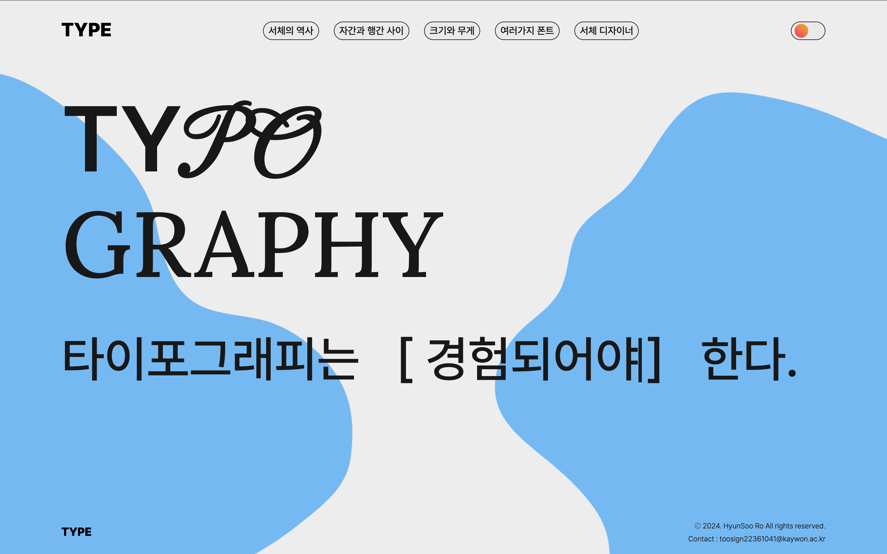

    
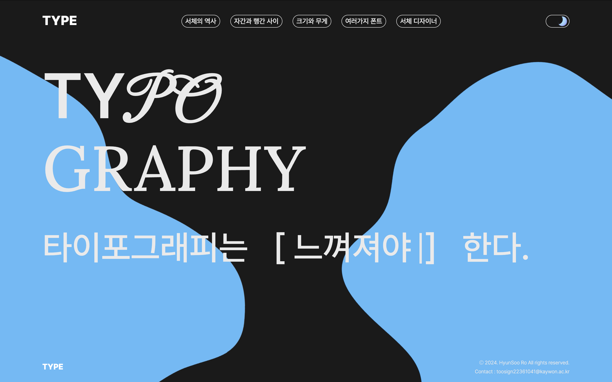

    
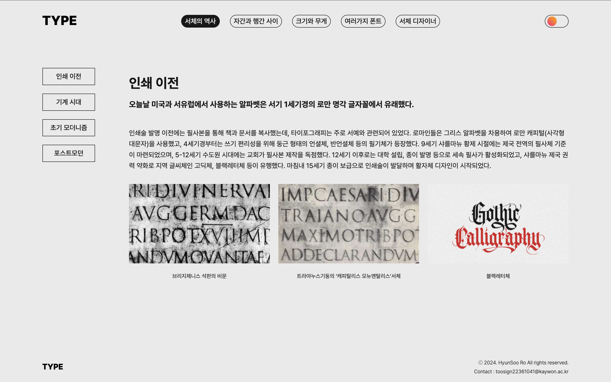

    
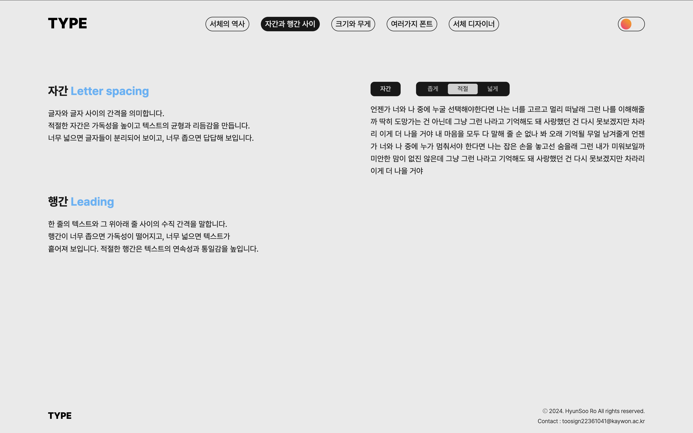

    
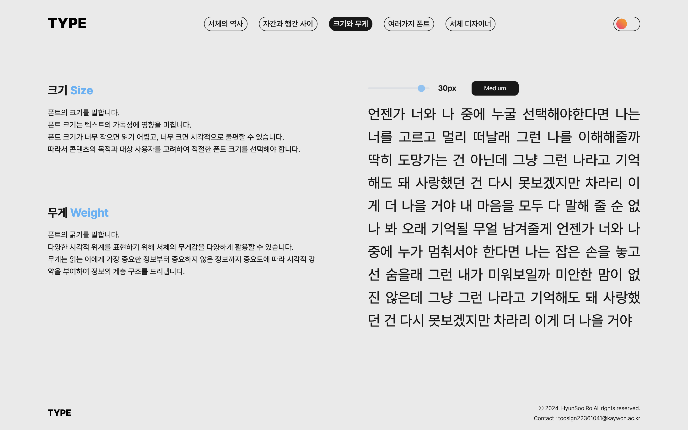

    
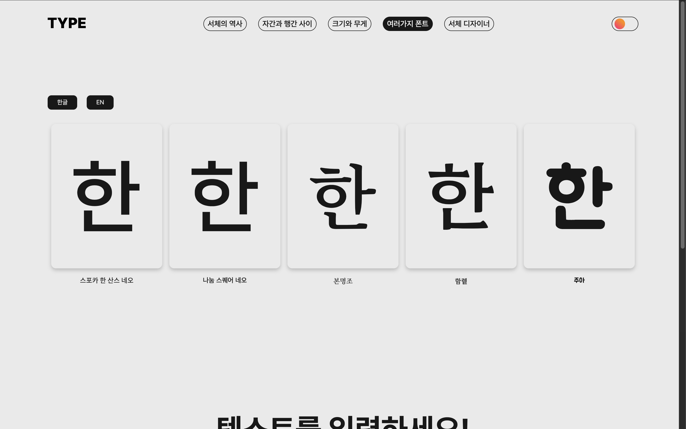

    
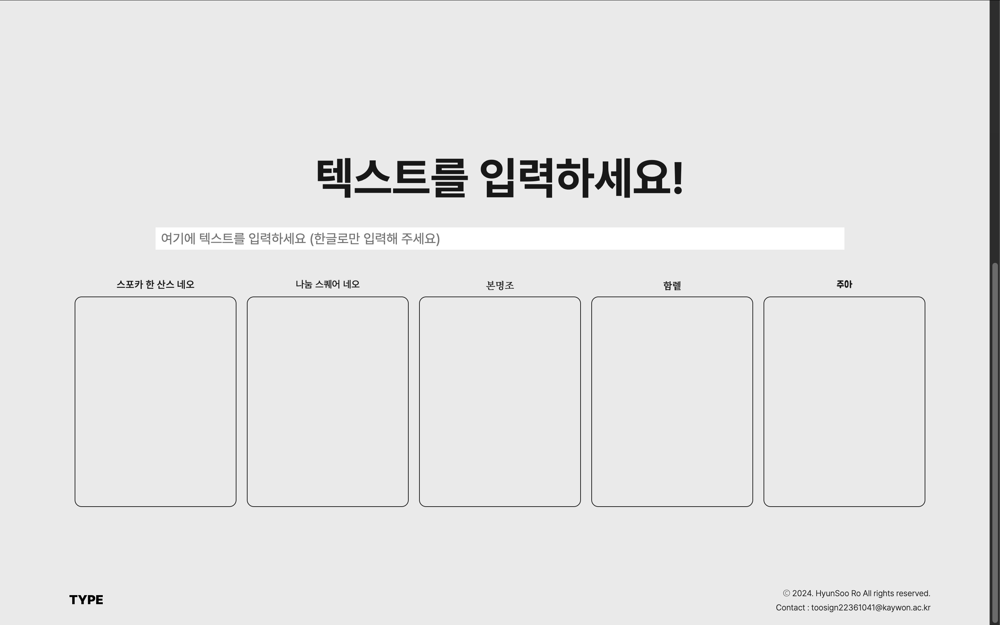

    
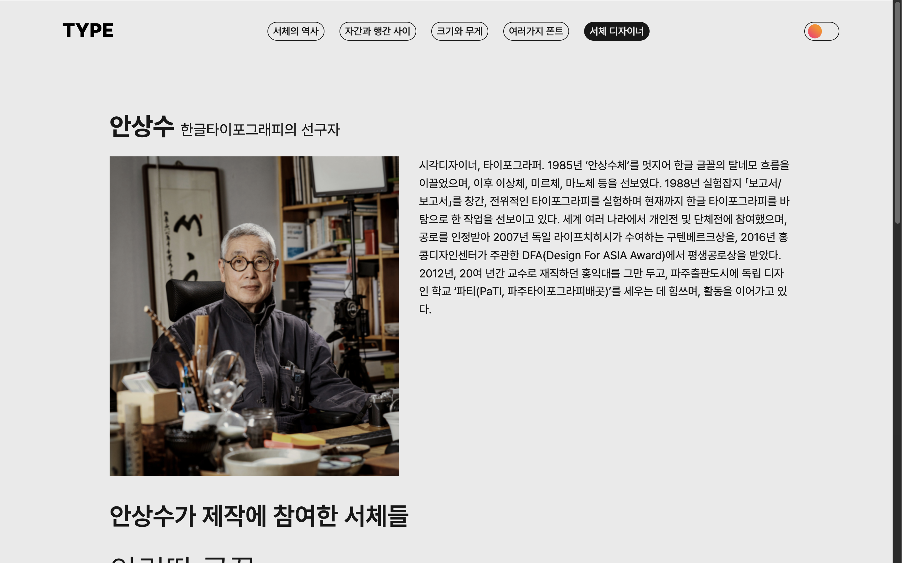

  

  

    <!-- Dots will be generated by JavaScript -->
  

#### [커뮤니케이션디자인국제공모전 공모작](https://toosign00.github.io/OLLY/)

  

    

    

    

    
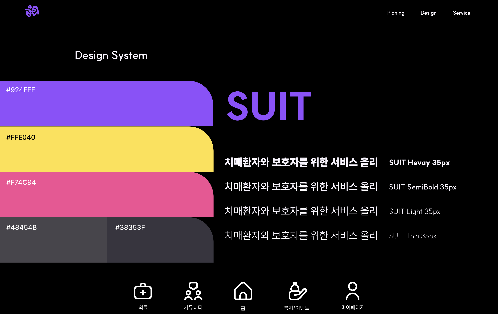

    
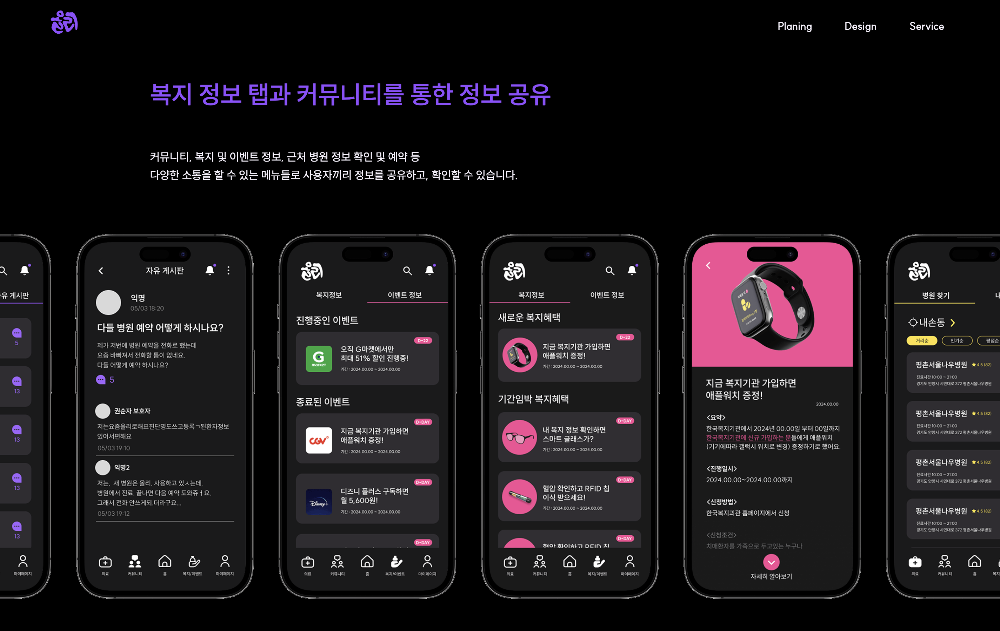

     

    

  

  

    <!-- Dots will be generated by JavaScript -->
  

#### [자바스크립트를 활용한 미니게임](https://toosign00.github.io/minigame/)

  

    

    

    

    

    

    

  

  

    <!-- Dots will be generated by JavaScript -->
  

#### [필름 매거진 웹사이트](https://toosign00.github.io/OLLY/)

  

    

    

    

    

    
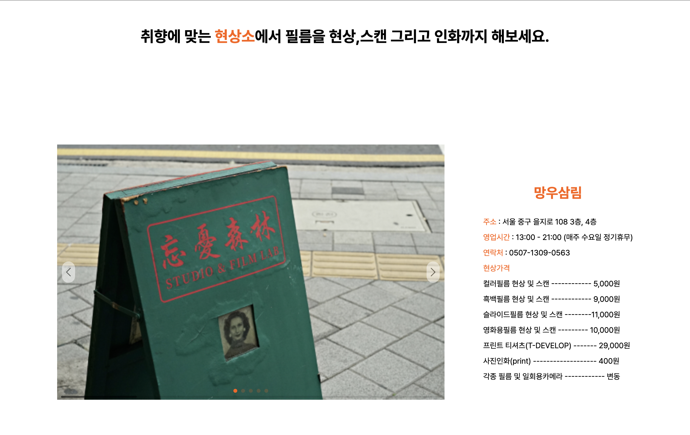

    
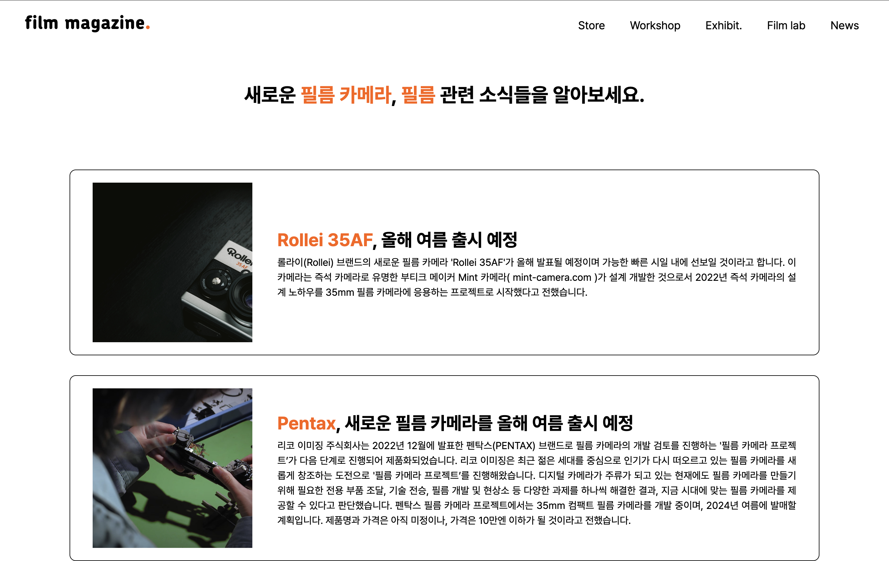

  

  

    <!-- Dots will be generated by JavaScript -->
  

